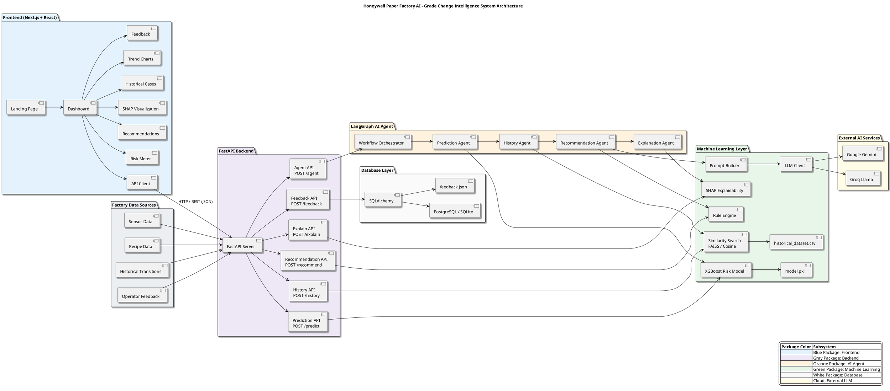

# Paper Factory AI — Honeywell Grade Change Intelligence System

> An end-to-end industrial AI platform built for paper mill operators to optimize grade transitions, predict off-spec paper risks in real-time, get explainable setpoint recommendations, and maintain closed-loop operator feedback.

---

## 1. Problem Statement

During paper grade transitions in industrial paper mills, operators must adjust multiple interconnected machine setpoints—such as steam pressure, machine speed, moisture content, stock flow, and filler ash addition. 

Small manual errors, delayed adjustments, or improper setpoint combinations cause:
- **High Off-Spec Paper Reel Waste**: Thousands of tons of off-spec paper produced during transition ramping.
- **Thermal Imbalances & Web Breaks**: Excessive steam or sudden speed shifts lead to web tears and mill downtime.
- **Energy & Resource Inefficiency**: Wasted thermal steam, electrical power, and chemical additives.
- **Lack of Real-Time Operator Guidance**: Operators often rely on intuition rather than data-driven recommendations during complex multi-variable grade switches.

**Paper Factory AI** solves this by uniting **XGBoost risk modeling**, **k-NN vector similarity search**, a **7-rule domain decision engine**, **SHAP feature explainability**, **Groq/Gemini LLM copilot narratives**, and a **LangGraph 4-stage agent orchestrator** into a single real-time decision dashboard.

---

## 2. Key Features

- 🎯 **Off-Spec Risk Prediction (`POST /predict`)**: Evaluates 7 core sensor parameters to output a real-time Off-Spec Risk % and classification.
- 🔍 **Historical Similarity Search (`POST /history/similar`)**: Vector-based k-NN search across historical grade transitions to retrieve similar past runs, operator actions, and alarms.
- ⚡ **7-Rule Domain Recommendation Engine (`POST /recommend`)**: Hardcoded paper mill operational rules generate immediate, actionable setpoint tweaks (e.g. *"Reduce Steam Pressure by 0.2 bar"*).
- 📊 **SHAP Feature Explainability (`POST /explain`)**: Calculates exact feature contribution percentages and dynamically renders Matplotlib Waterfall, Bar, and Summary plots.
- 🤖 **LangGraph Multi-Agent Pipeline (`POST /agent`)**: 4-node `StateGraph` DAG orchestrating Prediction $\rightarrow$ History $\rightarrow$ Recommendation $\rightarrow$ Explanation into a single response.
- 🗣️ **LLM Copilot Summaries**: Generates operator-friendly narrative advice via Groq (`llama-3.3-70b-versatile`) or Gemini, with offline fallback narrative generation.
- 🔄 **Closed-Loop Feedback System (`POST /feedback`)**: Captures operator accept/reject actions for recommendations, updating real-time AI accuracy stats (91%+ baseline).

---

## 3. Tech Stack

| Layer | Technologies & Tools |
|---|---|
| **Frontend** | Next.js 16 (App Router), React 19, TypeScript, Vanilla CSS + TailwindCSS, Lucide Icons |
| **Backend API** | FastAPI, Uvicorn, Pydantic v2, Python 3.12 |
| **AI / Agent Framework** | LangGraph (`StateGraph` DAG Orchestrator) |
| **Machine Learning** | XGBoost Classifier, Scikit-learn, Joblib, NumPy, Pandas |
| **Explainable AI (XAI)** | SHAP (SHapley Additive exPlanations), Matplotlib (`Agg` backend) |
| **Vector Search** | k-NN Nearest Neighbors Index (`scikit-learn` / FAISS / Cosine Similarity) |
| **LLMs & GenAI** | Groq Cloud API (`llama-3.3-70b-versatile`), Google Gemini API |
| **Database & ORM** | SQLAlchemy ORM, PostgreSQL / SQLite (`paper_mill.db`), JSON File Fallback |
| **Deployment** | Vercel Serverless Function (`api/main.py`), Local Uvicorn Server |

---

## 4. Installation & Setup

### Prerequisites
- **Python**: 3.10 or higher
- **Node.js**: 18.0 or higher
- **Package Managers**: `pip` and `npm`

### Step 1: Clone the Repository
```bash
git clone https://github.com/bidhuripriyanshu/Grade-ai-Honeywell.git
cd Grade-paper-ai
```

### Step 2: Backend Setup
```bash
cd backend

# Create virtual environment
python -m venv venv

# Activate virtual environment
# Windows:
.\venv\Scripts\activate
# Linux/macOS:
source venv/bin/activate

# Install dependencies
pip install -r requirements.txt

# Start FastAPI development server
python -m uvicorn api.main:app --reload --port 8000
```
- API Documentation (Swagger UI): `http://localhost:8000/docs`

### Step 3: Frontend Setup
```bash
cd ../frontend

# Install node modules
npm install

# Start Next.js development server
npm run dev
```
- Web Application Dashboard: `http://localhost:3000`

---

## 5. System Architecture

### Architectural Overview Diagram

```
                 ┌─────────────────────────────────────────────────────────────┐
                 │                 Frontend (Next.js + React)                  │
                 │ ┌──────────────┐   ┌──────────────────────────────────────┐ │
                 │ │ Landing Page │──>│ Dashboard                            │ │
                 │ └──────────────┘   │  • Risk Meter     • Recommendations │ │
                 │                    │  • SHAP Visual    • Historical Cases │ │
                 │                    │  • Trend Charts   • Feedback Buttons │ │
                 │                    └──────────────────┬───────────────────┘ │
                 └───────────────────────────────────────┼─────────────────────┘
                                                         │ HTTP REST / JSON API Client
                                                         ▼
┌──────────────────────────────────────────────────────────────────────────────────────────────┐
│                                   FastAPI Backend Server                                     │
│ ┌──────────────────────────────────────────────────────────────────────────────────────────┐ │
│ │ Endpoints: POST /predict | POST /history/similar | POST /recommend | POST /explain       │ │
│ │            POST /agent   | POST /feedback         | GET  /feedback/stats                 │ │
│ └──────────────────────────────────────────────┬───────────────────────────────────────────┘ │
│                                                │                                             │
│       ┌────────────────────────────────────────┼───────────────────────────────────────┐     │
│       ▼                                        ▼                                       ▼     │
│ ┌───────────────────────────┐    ┌───────────────────────────┐           ┌──────────────────┐│
│ │   Machine Learning Layer  │    │  LangGraph AI Agent Layer │           │ Database Layer   ││
│ │ ┌───────────────────────┐ │    │ ┌───────────────────────┐ │           │ ┌──────────────┐ ││
│ │ │ XGBoost Risk Model    │ │    │ │ Workflow Orchestrator │ │           │ │ SQLAlchemy   │ ││
│ │ │ (model.pkl)           │ │    │ └───────────┬───────────┘ │           │ └──────┬───────┘ ││
│ │ └───────────────────────┘ │    │             ▼             │           │        │         ││
│ │ ┌───────────────────────┐ │    │ ┌───────────────────────┐ │           │        ▼         ││
│ │ │ k-NN Similarity Search│ │    │ │ 1. PredictionAgent    │ │           │ ┌──────────────┐ ││
│ │ │ (historical_dataset)  │ │    │ └───────────┬───────────┘ │           │ │ PostgreSQL / │ ││
│ │ └───────────────────────┘ │    │             ▼             │           │ │ SQLite       │ ││
│ │ ┌───────────────────────┐ │    │ ┌───────────────────────┐ │           │ └──────────────┘ ││
│ │ │ 7-Rule Engine         │ │    │ │ 2. HistoryAgent       │ │           │ ┌──────────────┐ ││
│ │ └───────────────────────┘ │    │ └───────────┬───────────┘ │           │ │ JSON Audit   │ ││
│ │ ┌───────────────────────┐ │    │             ▼             │           │ │ Backup       │ ││
│ │ │ SHAP Explainability   │ │    │ ┌───────────────────────┐ │           │ └──────────────┘ ││
│ │ └───────────────────────┘ │    │ │ 3. RecommendationAgent│ │           └──────────────────┘│
│ │ ┌───────────────────────┐ │    │ └───────────┬───────────┘ │                               │
│ │ │ Prompt Builder & LLM  │─┼────┼──┐          ▼             │                               │
│ │ └───────────────────────┘ │    │ ┌┴──────────────────────┐ │                               │
│ └──────────────┬────────────┘    │ │ 4. ExplanationAgent   │ │                               │
│                │                 │ └───────────────────────┘ │                               │
│                ▼                 └───────────────────────────┘                               │
│   ┌──────────────────────────┐                                                               │
│   │ External AI Services     │                                                               │
│   │ • Groq Cloud (Llama-3.3) │                                                               │
│   │ • Google Gemini          │                                                               │
│   └──────────────────────────┘                                                               │
└──────────────────────────────────────────────────────────────────────────────────────────────┘
```

### Complete PlantUML Architecture Diagram Code

Below is the complete PlantUML architecture diagram code representing all subsystems, routers, agents, and data flow layers:



---

## 6. Dashboard Interface & Features

The Next.js 16 Web Dashboard provides a high-density, real-time control UI built for paper mill operators:

1. **Risk Meter Gauge**: Visualizes real-time off-spec probability (0–100%) with color-coded safety zones (Normal <40%, Moderate 40–70%, High >70%).
2. **Interactive Live Test Drawer (`LiveTestDrawer`)**: Allows operators to simulate grade changes by adjusting sliders for 7 parameters:
   - Machine Speed (RPM)
   - Steam Pressure (bar)
   - Stock Flow (L/min)
   - Moisture (%)
   - Ash Content (%)
   - Paper Recipe (Grade A/B/C)
   - Basis Weight (g/m²)
3. **Actionable Recommendation Cards (`RecommendationCard`)**: Displays precise setpoint guidance (e.g. *"Reduce Steam Pressure by 0.2 bar"*) alongside LLM copilot rationale.
4. **SHAP Feature Impact Charts (`ShapChart`)**: Interactive Matplotlib rendered plots (Bar, Waterfall, Summary) detailing parameter contribution percentages.
5. **Similar Transition Cases Table (`SimilarCasesTable`)**: Lists top-K historical transitions matching current sensor profiles, showing outcomes and past alarms.
6. **Grade Transition Timeline (`ProcessTimeline`)**: Visualizes real-time process state steps from target grade selection to sheet stabilization.
7. **Closed-Loop Feedback Controls (`FeedbackButtons`)**: Enables operators to accept or reject recommendations with one click, persisting audit records and calculating live AI accuracy.

---

<<<<<<< HEAD
## 7. API Reference

| Endpoint | Method | Input Payload | Output Description |
|---|---|---|---|
| `/` | `GET` | None | Health check & system version metadata |
| `/predict` | `POST` | `SensorData` JSON | Returns Off-Spec Risk %, risk level, and classification |
| `/model-info` | `GET` | None | Lists model features, valid recipes, and model status |
| `/history/similar` | `POST` | `SensorData` + `top_k` | Returns top-K similar past grade transitions & setpoints |
| `/history/grades` | `GET` | None | Returns supported paper grade target list |
| `/history/recipes` | `GET` | None | Returns valid recipe options |
| `/recommend` | `POST` | `SensorData` JSON | Evaluates 7 domain rules & returns LLM copilot guidance |
| `/recommend/rules` | `GET` | None | Lists all active paper mill domain rules |
| `/explain` | `POST` | `SensorData` JSON | Calculates SHAP feature impact % & generates PNG charts |
| `/explain/plots/{name}` | `GET` | Plot Name (`bar.png`, `waterfall.png`) | Serves generated Matplotlib image files |
| `/agent` | `POST` | `SensorData` JSON | Executes full 4-stage LangGraph Agent pipeline |
| `/agent/graph` | `GET` | None | Returns LangGraph node & edge structure |
| `/feedback` | `POST` | `OperatorFeedback` JSON | Saves operator accept/reject actions to DB |
| `/feedback/stats` | `GET` | None | Returns total feedback count, acceptance count, and AI accuracy % |

---

## 8. Future Scope

- 🌐 **OPC-UA & Modbus IoT Integration**: Direct real-time streaming integration with industrial DCS (Distributed Control Systems) such as Honeywell Experion PKS.
- ⚡ **Closed-Loop Autonomous Setpoint Control**: Moving from operator recommendation advisory mode to automated PLC setpoint adjustment under safety bounds.
- 🧠 **Reinforcement Learning (RL) Optimization**: Fine-tuning transition paths using RL agents trained on historical paper machine physics simulators.
- 🛡️ **Edge Deployment & Micro-Services**: Packaging inference models into lightweight ONNX runtimes for low-latency edge deployment on factory edge gateways.
- 📈 **Multi-Mill Federated Learning**: Training risk models across multiple paper mill locations while protecting proprietary mill dataset privacy.
=======
```
>>>>>>> df3cffc7b95426424b7a2cad1a3ffc1ea5609e90

---

## License

Internal Honeywell Industrial Copilot Platform project.
